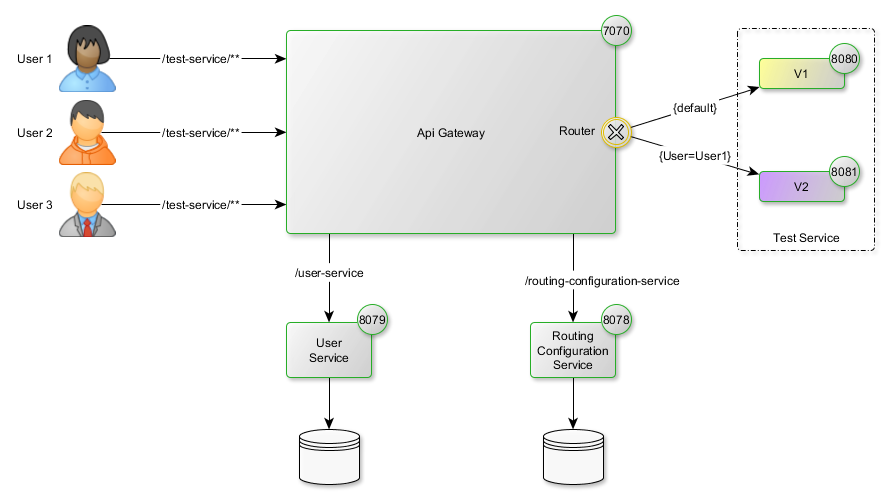

# Service Routing by User

The goal of this POC is to validate the capability to dynamically redirect users' request to a given version of a service withouth any downtime.



```yml
zuul:
  routes:
    test-service:
      url: "DYNAMIC|http://localhost:8080"
    user-service:
      url: "http://localhost:8079"
    routing-configuration-service:
      url: "http://localhost:8078"
```

Given the context path "test-service":
* User-Service aims to bind a user to a version for this context path
* Routing-Configuration-Service aims to bind a version to a location for this context path
* API-Gateway relies on both services in order to find which location to use for a given user request regarding to this context path